# 🏥 Swasth Clinic — Healthcare Appointment Management System

Swasth Clinic is a full-stack, end-to-end healthcare appointment scheduling, symptom triage, and management platform. Designed for seamless interactions across three distinct roles—**Patients**, **Doctors**, and **Administrators**—it features dynamic email notifications via Nodemailer, real-time schedule management, and AI-assisted symptom triage powered by Google Gemini.

---

## 🔗 Live Demo Links

- **Frontend Deployment:** [https://healthcare-appointment-mangement-sy.vercel.app](https://healthcare-appointment-mangement-sy.vercel.app)
- **Backend API Deployment:** [https://swasth-clinic-backend.onrender.com](https://swasth-clinic-backend.onrender.com)

---

## 🔑 Demo Test Credentials

You can test all 3 player roles directly on the live platform using the pre-configured credentials below:

| Role | Email | Password | UI Badge Indicator |
| :--- | :--- | :--- | :--- |
| **Patient** | `patient1@test.com` | `password123` | **Green Tag** (`Patient`) |
| **Doctor** | `doctor1@test.com` | `doctorpass123` | **Charcoal Tag** (`Doctor`) |
| **Admin** | `admin@test.com` | `adminpass123` | **Gold Tag** (`Admin`) |

---

## 🖼️ Application Overview & UI Gallery

### 1. Portal Selection & Landing
Select your role directly from the main portal screen to access role-specific features.

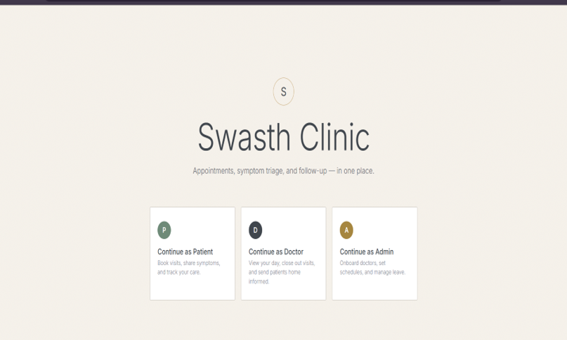

---

### 2. Patient Experience Flow
Patients can browse doctors, schedule time slots, state symptoms, view AI urgency badges, and receive automated email confirmations.

* **Step 1:** Click **"Continue as Patient"** and log in using `patient1@test.com` / `password123`. Confirm the top bar displays the **Green "Patient" Tag**.
* **Step 2:** Under **"Book a Visit"**, search/browse available doctors, select **"View Slots"** on Dr. Smith, choose your date and time slot, type your symptoms, and confirm your booking.
* **Step 3:** Switch to the **"My Appointments"** tab to view your active/past bookings along with AI urgency triage badges, chief complaints, and suggested follow-up questions.

#### Patient Authentication
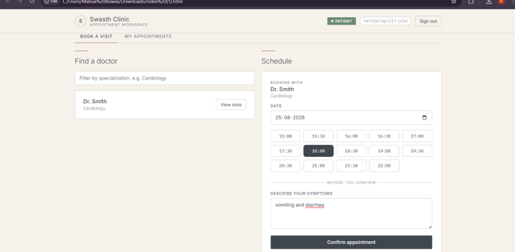

#### Booking & Appointment Overview
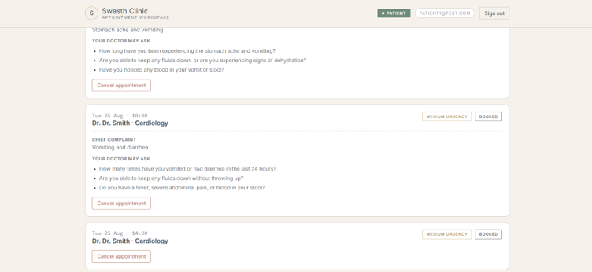

#### My Appointments & AI Urgency Triage
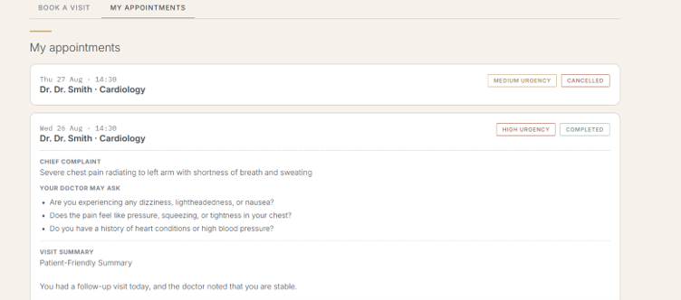

---

### 3. Doctor Experience Flow
Doctors can manage their daily schedule, review patient chief complaints and AI triage badges, close out completed visits, and write prescriptions.

* **Step 1:** Sign out, return to the landing page, click **"Continue as Doctor"**, and sign in using `doctor1@test.com` / `doctorpass123`. Confirm the top bar displays the **Charcoal "Doctor" Tag**.
* **Step 2:** Navigate to **"Today's Appointments"** to review patient details.
* **Step 3:** Select **"Close Visit"** to attach clinical notes, optionally provide a prescription, and save the visit record.

#### Doctor Authentication
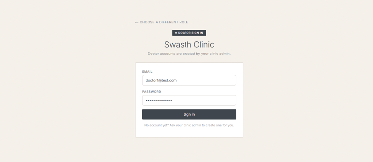

#### Doctor Daily Schedule & Visit Management
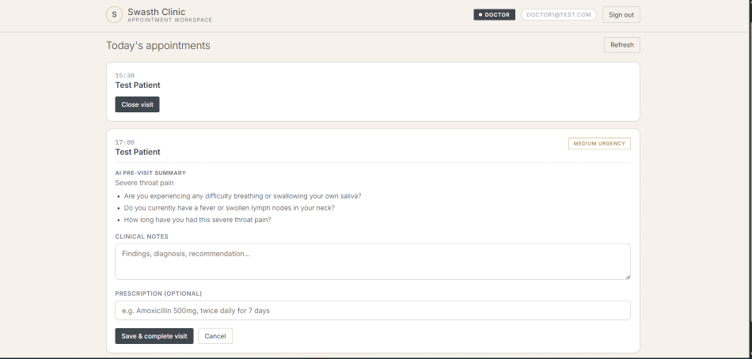

---

### 4. Administrator Experience Flow
Admins oversee clinic operations, onboard new doctors to the system, and manage weekly availability schedules.

* **Step 1:** Sign out, return to the landing page, click **"Continue as Admin"**, and sign in using `admin@test.com` / `adminpass123`. Confirm the top bar displays the **Gold "Admin" Tag**.
* **Step 2:** Check the **"Add Doctor"** tab to view the doctor onboarding form and current medical roster.
* **Step 3:** Check the **"Manage Schedules"** tab, select a doctor, and set or verify working hours.

#### Admin Authentication
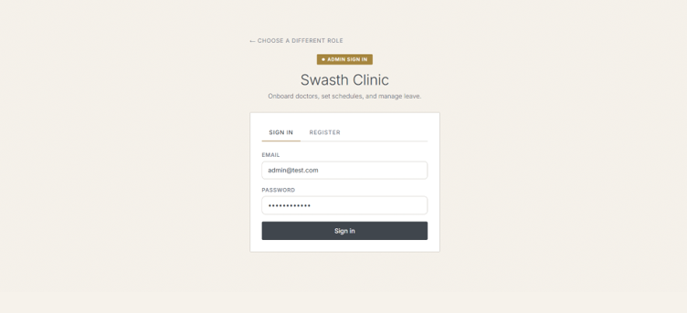

#### Doctor Roster & Onboarding Controls
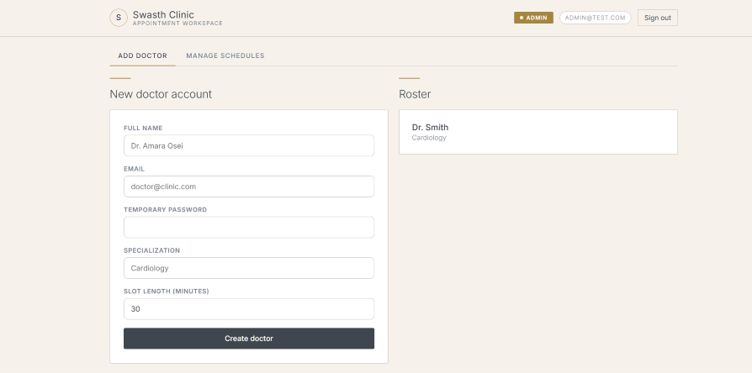

#### Doctor Schedule & Availability Management
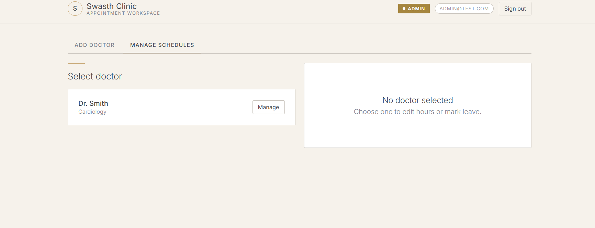

---

### 5. Dynamic Email Notifications
Whenever an appointment action occurs (booking, cancellation, update), automated emails are dynamically dispatched through Nodemailer using system credentials to all relevant parties.

#### Appointment Email Notification
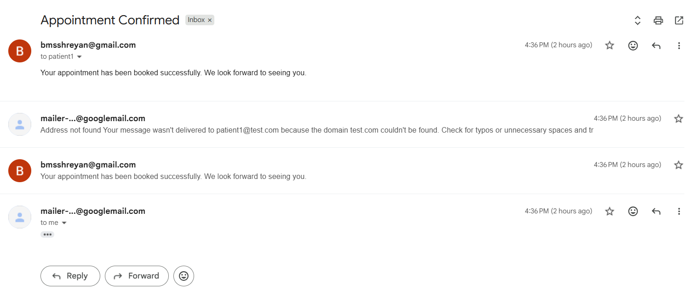

#### Cancellation Alert Sent to User
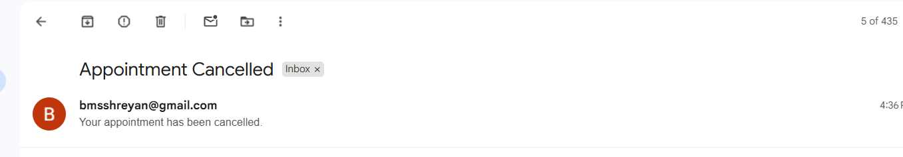

---

## 🛠️ System Architecture & Tech Stack

- **Frontend:** HTML5, CSS3, JavaScript / TypeScript (Deployed on Vercel)
- **Backend Framework:** Node.js, Express.js, TypeScript (Deployed on Render)
- **Database:** PostgreSQL (Hosted on Neon DB) with Prisma ORM
- **Cache & Message Queue:** Redis, BullMQ
- **Email Dispatch Service:** Nodemailer (SMTP Gateway)
- **AI Triage Integration:** Google Gemini API (`@google/generative-ai`)

---

## 🚀 Local Development Setup

To run this project locally, clone the repository and configure your environment variables.

### 1. Clone the Repository
```bash
git clone [https://github.com/shreyan1905/Healthcare_Appointment_Mangement_System.git](https://github.com/shreyan1905/Healthcare_Appointment_Mangement_System.git)
cd Healthcare_Appointment_Mangement_System